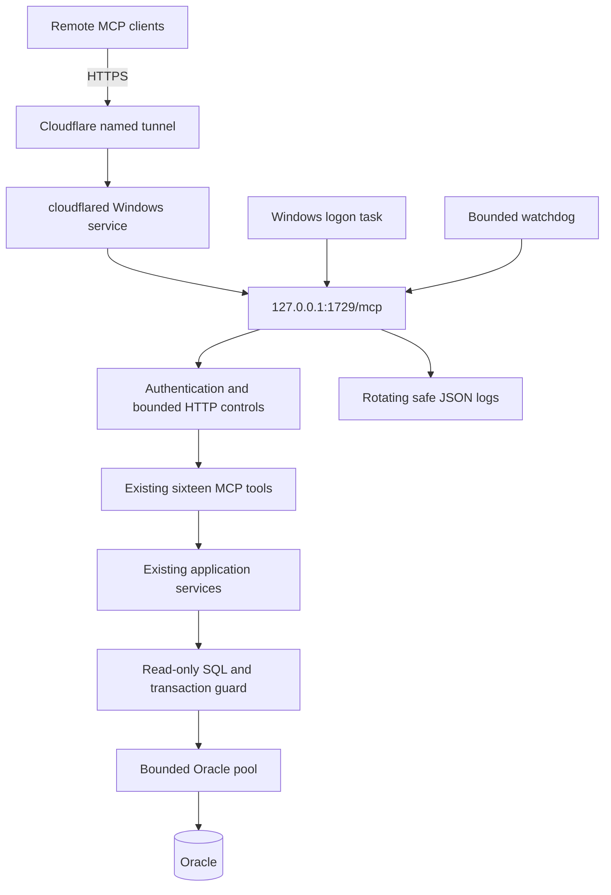

# CVING_MCP implementation and deployment report

Date: 2026-09-22. Verdict: **PARTIALLY READY**. Source changes and focused tests
are complete; elevated installation and named-tunnel deployment are not complete.
No Oracle data, objects or grants were modified. Existing .env was not changed.

## 1. Existing architecture found
Streamable HTTP MCP SDK/Uvicorn at 127.0.0.1:1729/mcp, OAuth-server with static
bearer fallback, sixteen existing service-backed tools and Quick Tunnel scripts.
The active listener predates this change; current saved public URL is unreachable.

## 2. Problems found
TCP-only startup checks, insufficient PID identity, no unified recovery, readiness
DB detail exposure, discarded audit extras, forwarded-host Origin trust,
unbounded rate-identity storage and no shared MCP-only read-only DB boundary.

## 3. Root causes
Multiple independent launchers and weak process bookkeeping; default logging
format ignored structured fields; HTTP and Oracle protections were incomplete.
Live testing additionally exposed denied CIM listener queries being treated as an
empty port. New code uses netstat and requires launched-process ownership proof.

## 4. Files created
- `backend/mcp_server/database_guard.py`
- `backend/mcp_server/observability.py`
- `backend/tests/test_mcp_hardening.py`
- `backend/tests/fixtures/mcp_tool_contract.json`
- `database/create_mcp_readonly_user.sql`
- `database/validation/validate_mcp_readonly_user.sql`
- `database/rollback/mcp_readonly_user.md`
- `scripts/mcp_common.ps1`
- `scripts/cloudflare_common.ps1`
- `scripts/start_mcp.ps1`
- `scripts/stop_mcp.ps1`
- `scripts/restart_mcp.ps1`
- `scripts/mcp_watchdog.ps1`
- `scripts/install_mcp_autostart.ps1`
- `scripts/uninstall_mcp_autostart.ps1`
- `scripts/install_cloudflared_service.ps1`
- `scripts/uninstall_cloudflared_service.ps1`
- `scripts/start_cloudflared.ps1`
- `scripts/stop_cloudflared.ps1`
- `scripts/restart_cloudflared.ps1`
- `scripts/start_all.ps1`
- `scripts/stop_all.ps1`
- `scripts/restart_all.ps1`
- `scripts/setup_cving_mcp_autostart.ps1`
- `scripts/cving_mcp_status.ps1`
- `scripts/diagnose_mcp.ps1`
- `scripts/test_mcp_lifecycle.ps1`
- `start_all.cmd`
- `stop_all.cmd`
- `restart_all.cmd`
- `setup_cving_mcp_autostart.cmd`
- `cving_mcp_status.cmd`
- `docs/MCP_OPERATIONS.md`
- `docs/MCP_AUTOSTART.md`
- `docs/MCP_SECURITY.md`
- `docs/CLOUDFLARE_TUNNEL.md`
- `docs/MCP_TROUBLESHOOTING.md`
- `docs/MCP_IMPLEMENTATION_REPORT.md`

## 5. Files modified
- `.env.example`
- `.gitignore`
- `CHANGELOG.md`
- `README.md`
- `backend/db.py`
- `backend/db_pool.py`
- `backend/mcp_server/cli.py`
- `backend/mcp_server/config.py`
- `backend/mcp_server/env_loader.py`
- `backend/mcp_server/security.py`
- `backend/mcp_server/server.py`
- `backend/mcp_server/service.py`
- `backend/tests/test_mcp_quick_tunnel.py`
- `docs/api-catalog.md`
- `scripts/import_mcp_local_env.ps1`
- `scripts/start_quick_tunnel.ps1`
- `scripts/start_remote_mcp.ps1`
- `scripts/startmcp.bat`
- `scripts/stop_quick_tunnel.ps1`
- `scripts/stop_remote_mcp.ps1`
- `scripts/stopmcp.bat`
- `setup_mcp_autostart.bat`
- `startmcp.bat`
- `stopmcp.bat`

## 6. Backups created
- `runtime/backups/2026-09-22_160502_mcp-autostart-hardening/manifest.json`
- `runtime/backups/2026-09-22_162011_mcp-quick-ownership/manifest.json`
- `runtime/backups/2026-09-22_162344_mcp-auth-required/manifest.json`
- `runtime/backups/2026-09-22_163158_mcp-db-failclosed/manifest.json`
- `runtime/backups/2026-09-22_163424_mcp-resource-error/manifest.json`
Timestamped manifests include SHA-256 hashes. These are pre-change backups of
existing files; newly created files have no pre-change version.

## 7. MCP auto-startup status
Implemented CVING_MCP_AutoStart and CVING_MCP_Watchdog at user logon. Installation
attempt stopped at the administrator check. No new task was installed here.

## 8. Cloudflare tunnel status
Current configured mode: legacy Quick Tunnel. Public probe unreachable. Named,
quick and disabled modes implemented; no automatic domain/account migration.

## 9. Windows service status
No cloudflared service was observed by the available service query. Named-service
installation/configuration/recovery scripts supplied but not executed: missing
real hostname/tunnel configuration and elevated Windows session.

## 10. Stable public MCP URL
Not configured. Requires an operator-owned DNS name and Cloudflare named tunnel.
The stale trycloudflare URL is not a permanent or validated public endpoint.

## 11. Security controls added
Authenticated loopback-only HTTP; no anonymous testing override; strict Origin
checks; safe errors and security headers; disabled debug/admin routes; bounded
rate identity memory; process ownership and lifecycle locks; secret-safe logs.

## 12. Oracle data protection added
Reused pool with MCP-only SET TRANSACTION READ ONLY, SQL lexer/deny rules,
rollback on release, no direct-connection fallback, per-query row bounds and
optional dedicated account settings. Current account inspection found broader
privileges than CREATE SESSION; DBA least-privilege work remains. Provisioning
SQL is a review template with EXIT before DDL. No grants were executed.

## 13. Rate limiting added
Existing per-token budget retained and strengthened with an aggregate transport
peer ceiling, at most 2048 identities and HTTP 429. Default 60/minute.

## 14. Concurrency controls added
HTTP and executing-worker caps; semaphore retained while cancelled synchronous
workers finish. One pool alias for legacy imports, configurable min/max (0/6).

## 15. Timeout controls added
45-second HTTP deadline, existing 30-second tool timeout, 15-second Oracle call
budget, 5-second pool acquisition and bounded network probes. Synchronous work
cannot be forcibly killed safely; executing-worker slots remain held until exit.

## 16. Watchdog status
Implemented and tested with mocks: three connectivity probes, only owned-process
recovery, maximum five attempts/ten minutes persisted, CRITICAL stop marker,
manual-stop preservation, tunnel-only recovery. Not running as an installed task.

## 17. Health endpoint status
New /health, /ready, /live and redacted legacy aliases pass application tests.
Active older listener still returns 404 on new paths; deployment restart is needed.

## 18. Logging/audit status
Rotating allowlisted JSON events include tool name, request ID, status and duration.
Raw SQL/exception text, message arguments and access URLs are not emitted.
Lifecycle logs and diagnostics exclude secrets; no logs claim a stable URL.

## 19. Tests added
SQL DML/DDL/chaining/package rejection; safe SELECTs; query limits; pool/read-only
release; loopback enforcement; secret-safe logs; timeout/capacity/rate controls;
Origin spoof rejection; health redaction; valid/invalid bearer; exact pre-change
16-tool input-schema fixture. PowerShell harness covers process/recovery safety.

## 20. Test results
- 95 focused Python tests passed (MCP, exact pre-change input schemas, chart service and price-action route); one dependency deprecation warning.
- PowerShell lifecycle harness passed: duplicate launch, unknown listener, ownership rejection, recovery, restart throttling and manual-stop behavior.
- PowerShell parsing, Python compilation, MCP environment preflight and focused Ruff checks passed.
- Duplicate API scan passed: 196 Flask routes, zero exact duplicates (22 similar paths reported).
- Live read-only Oracle adapter probes: 15 of 16 tool paths succeeded; cold broad scan hit the configured source-row budget and fails safely as RESOURCE_LIMIT.
- Coverage could not be measured: this MCP environment does not expose pytest --cov options. The requested 99% critical-code coverage target is not verified.
- Full repository enterprise_validate, frontend suites, SCM installation/recovery, reboot and named public endpoint checks were not completed. No unrelated frontend code changed.
- Git status could not resolve the enclosing repository under the current sandbox, so ignore rules were inspected directly rather than claiming a clean Git index.

## 21. Local MCP test
The existing live endpoint returned expected 401; listener 127.0.0.1:1729 was
confirmed with netstat. Authenticated live tools/list returned all 16 tools. Its PID was not adopted or killed. Live read-only Oracle
adapter probes succeeded for health/readiness, list_symbols and all per-symbol
tools. Cold scan_price_action exceeded the 5000-row budget and returns
RESOURCE_LIMIT; no partial result is promoted. Refresh its existing application
snapshot through the normal authorized application workflow before scanning.

## 22. Public MCP test
Saved Quick Tunnel URL was unreachable. No named-tunnel URL was available to test.
No claim of remote client connectivity or stable DNS is made.

## 23. Remaining manual actions
1. Supply actual named hostname, tunnel UUID and absolute config/credentials path;
   protect files with Windows ACLs and configure Cloudflare DNS/ingress.
2. Stop the older untracked MCP through its verified original owner, then run
   setup_cving_mcp_autostart.cmd from an elevated PowerShell window. The new
   launcher intentionally refuses to kill/adopt untracked processes.
3. DBA-review/provision the read-only account and required SELECT grants. Do not
   grant DML or ANY privileges. Verify all source dependencies and PUBLIC grants.
4. Prepare the existing price-action snapshot for bounded MCP scans, then validate
   authenticated tools/list, all tool calls, public 401/OAuth and new health routes.
5. Perform an actual sign-out/logon or reboot test and confirm unchanged public URL.
   Built-in in-memory OAuth sessions may require reauthorization after restart.

## 24. Final architecture diagram

## 25. Final verdict
**PARTIALLY READY**: implementation and focused validation are available; elevated
installation, named-tunnel configuration, least-privilege provisioning, cold-scan
snapshot availability and reboot/public verification remain deployment gates.

## Rollback
Stop the owned stack; uninstall only owned tasks/service with the supplied scripts.
Restore modified files from the manifests above, leaving unrelated work intact.
Do not delete project/database data. No database rollback is necessary because
no database changes were performed. See MCP_OPERATIONS.md for exact commands.
